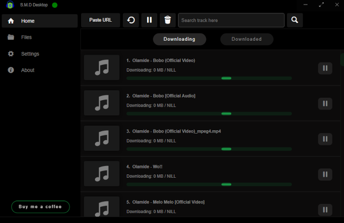

<h1 align="center" style="border-bottom: none">
  

    
  

  Spotify Music Downloader
</h1>

  An Open-Sourced Cross-Platform desktop application to search and download songs. Also integrates with the Spotify API

      
    
     
    

 

  

 

**Please note**: This application is still in development, ping me - mailto:iebenmelu@gmail.com, I will tell you when I have released the first version and also send you a link to download it. You could also watch the project.

## About S.M.D

> This is a desktop
> application that seamlessly integrates with the Spotify API to help you discover, download, and enjoy your favorite
> songs from a single platform! With this powerful and user-friendly application, you can easily search for any song
> and instantly download high-quality audio files directly to your desktop. Whether you're a music enthusiast or just
> looking to build your personal music library, this app provides you with the exact music to download and enjoy.
> Thanks to the integration with the Spotify API, you can easily download entire albums or playlist with just a few
> clicks. The app features a sleek and modern interface that makes it easy to navigate and use, even for those with
> little to no technical knowledge. With its advanced search capabilities and intuitive download manager, you can
> find and download your favorite songs in seconds.

## Contributing

[Full step-by-step guide on how to contribute](https://github.com/noahweasley/SMD-desktop/blob/master/contributing.md)

## Download

- Most recent packages are available at Releases page: https://github.com/noahweasley/smd-desktop/releases

- Product website is also available for easy download: https://noahweasley.github.io/SMD-Desktop

## License

S.M.D :copyright: is under the GPL 3.0 license

Please review [license](https://github.com/noahweasley/SMD-desktop/blob/master/license) to get full details.
